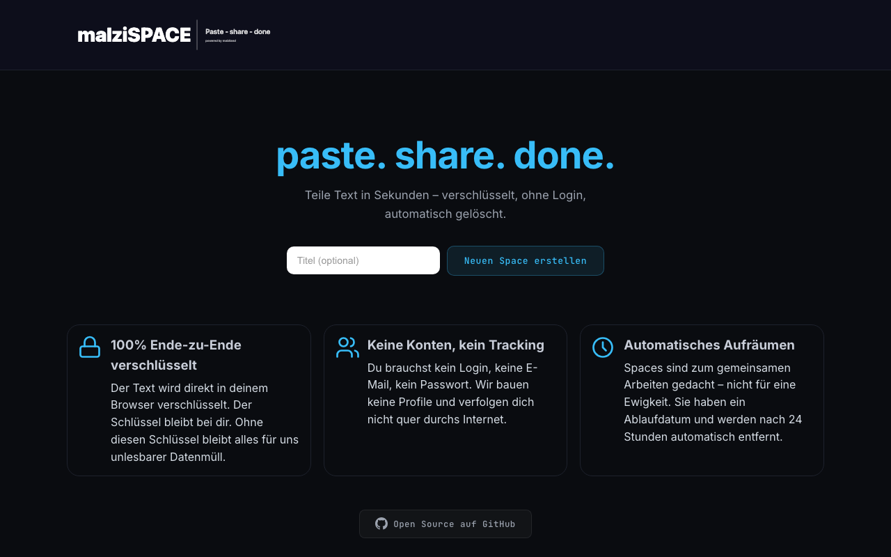
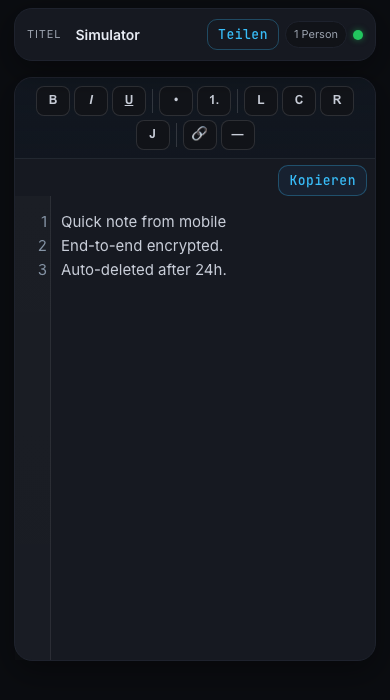
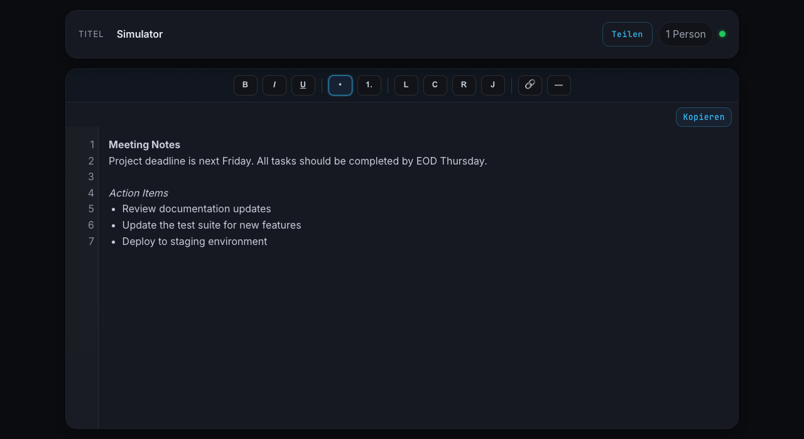

# malziSPACE — paste. share. done.

[](https://github.com/malziland/malzispace/blob/main/LICENSE)
[](https://malzi.space)

[](https://github.com/malziland/malzispace/actions/workflows/verify.yml)
[](https://github.com/malziland/malzispace/actions/workflows/verify.yml)

> **[malzi.space](https://malzi.space)** — Jetzt ausprobieren

Minimaler Paste-Service mit Echtzeit-Zusammenarbeit, Ende-zu-Ende-Verschluesselung im Browser und automatischer Loeschung nach 24 Stunden. Kein Login, kein Tracking, keine Konten.

**Dein Text gehoert dir. Wir koennen ihn nicht lesen.**

<p align="center">
  
</p>
<p align="center">
  
</p>

## Features

- **Ende-zu-Ende-Verschluesselung**: AES-256-GCM direkt im Browser — der Schluessel bleibt im URL-Fragment und verlässt nie den Client
- **Echtzeit-Zusammenarbeit**: Mehrere Personen bearbeiten denselben Space gleichzeitig (Yjs CRDT + WebSocket Relay)
- **Rich-Text-Editor**: Fett, Kursiv, Unterstrichen, Listen, Links, Horizontale Linien, Textausrichtung
- **24h Auto-Loeschung**: Spaces werden automatisch nach 24 Stunden entfernt — keine Ewigkeits-Daten
- **QR-Code-Sharing**: Link per QR-Code teilen — Schluessel inklusive
- **Zeilennummern**: Optische Orientierung im Editor mit synchronisierten Zeilennummern
- **Praesenz-Anzeige**: Sehen, wer gerade im Space aktiv ist
- **Verschluesselte Titel**: Auch Space-Titel werden clientseitig verschluesselt (AES-256-GCM)
- **Mehrsprachig**: Deutsch und Englisch mit automatischer Spracherkennung
- **Kein Tracking**: Keine Cookies, keine Analytics, keine Werbung, keine Nutzerprofile
- **Feature Flags**: CRDT, WebSocket und Praesenz einzeln per URL-Parameter steuerbar
- **Open Source**: MIT-Lizenz, vollstaendig einsehbar

<p align="center">
  
</p>

## Architektur

```
apps/web/public/                Firebase Hosting (statische Seite, kein Build-Framework)
  index.html                    Startseite (Space erstellen)
  space.html                    Space-Editor (Rich Text + Collaboration)
  editor-simulator.html         Editor-Simulator fuer E2E-Tests
  assets/
    modules/                    20 ES6-Module (modularer Editor)
      app.js                    Entry Point
      core/                     Context, Konstanten, DOM-Utilities, Formatting
      editor/                   Blocks, Commands, Clipboard, Inline-Format, Keyboard, Line-Numbers
      network/                  Collaboration (WebSocket + Yjs CRDT Sync)
      services/                 Crypto (AES-256-GCM), History, Sanitizer, Selection
      ui/                       Toolbar, Modals, Status
      dev/                      Selftest-Suite
    config.js                   Firebase-Config + Feature Flags
    i18n.js                     Internationalisierung (DE/EN)
    appcheck.js                 Firebase App Check (Proof-of-Work Provider)
    index-create.js             Landing-Page Create-Flow
    editor-simulator.js         Mock-Fetch fuer Simulator-Tests
    base.css                    Basis-Styles + Dark Theme + Fonts
    space.css                   Editor-spezifische Styles
    landing.css                 Startseiten-Styles
  impressum.html                Impressum
  privacy.html                  Datenschutzerklaerung
  agb.html                      Nutzungsbedingungen

services/api/                   Firebase Cloud Functions (2nd Gen, Node 24, europe-west1)
  index.js                      Express API (Create, Load, Save, Title, Yjs, Presence, Cleanup)
  lib/
    rateLimiter.js              Per-Instance Rate Limiting (IP-basiert)
    clientIp.js                 Trusted Client IP Derivation
    appCheckPow.js              Proof-of-Work Challenge/Verify
    originPolicy.js             Strenge Origin-Whitelist
    payloadBudget.js            Ciphertext-Size Budget Enforcement

services/collab-relay/          WebSocket Broadcast Relay (Cloud Run, europe-west3)
  index.js                      Relay-Server (Yjs-Updates, raum-gebunden)
  lib/                          Auth, Rate Limiting, Heartbeat
  Dockerfile                    Cloud Run Deployment
  test/                         Relay-Tests

infra/firebase/                 Sicherheitsregeln
  firestore.rules               Alle Client-Zugriffe gesperrt (nur Functions)
  database.rules.json           Alle Client-Zugriffe gesperrt (nur Functions)

tests/                          Testsuiten
  e2e/                          Playwright E2E (Desktop + Mobile)
  live/                         Smoke + Load Tests (gegen Produktions-API)

tools/                          Repository Checks + Helpers
ops/                            Verify, Deploy, Restore-Point Workflows
docs/                           Architektur, Ops, Security, Legal, Frontend Docs
```

## Privacy-Architektur

Datenschutz ist kein Feature — es ist das Fundament:

- **Zero-Knowledge-Prinzip**: Der Server sieht nur Ciphertext — Klartext existiert ausschliesslich im Browser
- **Schluessel im URL-Fragment**: Der AES-256-GCM-Schluessel steht nach dem `#` und wird nie an den Server gesendet
- **Verschluesselte Titel**: Auch Space-Titel werden clientseitig verschluesselt, bevor sie den Server erreichen
- **Write-Authorization**: Schreibzugriffe erfordern `key_proof` (SHA-256 Hash des Schluessels) — der Server kann autorisieren, ohne den Schluessel zu kennen
- **Keine Speicherung**: Spaces werden nach 24h automatisch geloescht (Firestore TTL + Scheduled Cleanup)
- **Keine externen Scripts**: Alle Assets self-hosted (Fonts: Inter + JetBrains Mono). Kein Google Fonts CDN, kein unpkg
- **Keine Cookies**: Kein Tracking, kein Session-Cookie, kein Analytics-Pixel
- **Strenge CSP**: `script-src 'self'` + Firebase AppCheck Domain. Keine Inline-Scripts, kein `unsafe-eval`
- **Privacy-Header**: HSTS mit Preload, X-Frame-Options DENY, Referrer-Policy no-referrer, Permissions-Policy restriktiv

Details: [malzi.space/privacy.html](https://malzi.space/privacy.html)

## Sicherheit

- **Content Security Policy** mit strikter Whitelist (kein `unsafe-inline` fuer Scripts, kein `unsafe-eval`)
- **HSTS** mit Preload (`max-age=31536000; includeSubDomains; preload`)
- **X-Frame-Options: DENY** — kein Embedding in fremden Seiten
- **X-Content-Type-Options: nosniff**
- **Cross-Origin-Opener-Policy: same-origin**
- **Cross-Origin-Resource-Policy: same-origin**
- **Referrer-Policy: no-referrer**
- **Permissions-Policy**: Kamera, Mikrofon, Geolocation, Payment, USB deaktiviert
- **Firebase App Check** mit Proof-of-Work Provider (kein reCAPTCHA, kein hCaptcha)
- **Honeypot-Feld** gegen Bots (client- und serverseitig)
- **Origin-Whitelist** fuer alle API-Zugriffe
- **Key-Proof-Autorisierung**: Schreibzugriffe brauchen SHA-256-Nachweis des Schluessels
- **Rate Limiting**: Granular pro IP, pro IP+Space, pro Endpunkt (bis zu 17 unabhaengige Limiter)
- **Payload-Budget**: 2 MiB/min pro IP fuer Schreibzugriffe
- **Firestore/RTDB-Regeln**: Alle Client-Zugriffe komplett gesperrt — nur Cloud Functions haben Zugang
- **Trusted IP Derivation**: Keine blinde Proxy-Trust, sondern kontrollierte IP-Ermittlung
- **Ciphertext-Validierung**: Base64url-Format und Algorithmus-Whitelist werden serverseitig geprueft

Details: [`SECURITY.md`](SECURITY.md) | [`docs/security/ABUSE_PROTECTION.md`](docs/security/ABUSE_PROTECTION.md) | [`docs/security/SECURITY_RUNBOOK.md`](docs/security/SECURITY_RUNBOOK.md)

## API

Alle Endpunkte laufen ueber Firebase Cloud Functions v2 (`/api/*`).

### Endpunkte

| Endpunkt | Methode | Beschreibung |
|----------|---------|--------------|
| `/api/appcheck/challenge` | GET | Proof-of-Work Challenge anfordern |
| `/api/appcheck/token` | POST | PoW-Loesung einreichen, App Check Token erhalten |
| `/api/create` | POST | Neuen Space erstellen (mit `key_proof`) |
| `/api/load` | GET | Space-Inhalt laden (Ciphertext) |
| `/api/save` | POST | Space-Inhalt speichern (Ciphertext + `key_proof`) |
| `/api/title` | POST | Space-Titel aktualisieren (verschluesselt + `key_proof`) |
| `/api/yjs/push` | POST | Yjs CRDT Update pushen (verschluesselt + `key_proof`) |
| `/api/yjs/pull` | GET | Yjs CRDT Snapshots + Updates laden |
| `/api/presence` | POST | Praesenz-Signal senden |

### Request (Create)

```json
{
  "key_proof": "base64url-sha256-hash",
  "title_enc": "base64url-aes-256-gcm-ciphertext",
  "title_nonce": "base64url-12-byte-iv",
  "title_algo": "aes-256-gcm"
}
```

### Response (Create)

```json
{
  "id": "abc123def456"
}
```

### Sicherheitsschichten (pro Request)

1. Origin-Whitelist
2. Pre-Verification Rate Limit (50 req/s pro IP)
3. App Check Token-Validierung
4. Endpunkt-spezifischer Rate Limit
5. Globaler IP-Rate-Limit (Cross-Space)
6. Payload-Budget-Pruefung
7. Key-Proof-Autorisierung (bei Schreibzugriffen)
8. Ciphertext-Format-Validierung

## Schnellstart

```bash
# 1. Repo klonen
git clone https://github.com/malziland/malzispace.git
cd malzispace

# 2. Firebase CLI installieren (falls noch nicht vorhanden)
npm i -g firebase-tools
firebase login

# 3. Dependencies installieren
npm install                                # Root + Tests
cd services/api && npm install && cd ../..  # API Functions
cd services/collab-relay && npm install && cd ../..  # Relay

# 4. Lokal verifizieren
./ops/verify_local.sh

# 5. Deploy
firebase deploy --only functions,hosting
```

## Tests

```bash
# Vollstaendige lokale Verifikation (9-Schritte-Pipeline)
./ops/verify_local.sh

# Nur E2E (Desktop + Mobile, 92 Tests)
npm run test:e2e:mobile

# Nur Unit-Tests + Coverage
npm run test:coverage:check

# Live Smoke Test (braucht App Check Token)
APP_CHECK_TOKEN="..." ./ops/verify_local.sh

# Live Verifikation (temporaerer Debug-Token + Smoke + Multiplayer)
./ops/verify_live.sh
```

### 9-Schritte-Verifikationspipeline

| Schritt | Beschreibung |
|---------|--------------|
| 1/9 | Repo-Hygiene (Dateinamen, Struktur) |
| 2/9 | Linting (ESLint) |
| 3/9 | Unit-Tests + Coverage Gate |
| 4/9 | Build Hosting Bundle (Content-Hashed Filenames) |
| 5/9 | Lokaler Testserver starten |
| 6/9 | Frontend Simulator E2E |
| 7/9 | Frontend Toolbar/Mobile E2E (Playwright, 92 Tests) |
| 8/9 | I18N/Legal E2E |
| 9/9 | Multiplayer Simulator E2E |

**E2E-Tests (92 Tests):** Playwright-basiert. Toolbar-Buttons, Textformatierung (Bold/Italic/Underline), Listen, Links, Zeilennummern, Word-Processor-Workflows, Chaos/Stability-Tests, Browser-Health-Checks. Alle Tests laufen in Desktop (1440x900) und Mobile (iPhone 12) Viewports.

## CI/CD

GitHub Actions Workflow `.github/workflows/verify.yml`:

- **Dependency Review** bei Pull Requests (`actions/dependency-review-action`)
- **Tests + Lint** bei jedem Push und Pull Request
- **npm audit** auf `high` Severity-Level (Root, API, Relay)
- **Playwright Chromium** fuer E2E-Tests
- **Vollstaendige 9-Schritte-Pipeline** (`./ops/verify_local.sh`)
- **Dependabot** prueft monatlich auf unsichere Dependencies (npm + GitHub Actions)
- Deploy erfolgt manuell per `firebase deploy`

## Feature Flags

Feature Flags leben in `apps/web/public/assets/config.js` und koennen per URL-Parameter ueberschrieben werden:

| Flag | Default | URL-Parameter | Beschreibung |
|------|---------|---------------|--------------|
| `enableCrdt` | `true` | `?ff_enableCrdt=0` | Yjs CRDT-Unterstuetzung |
| `enableWs` | `true` | `?ff_enableWs=0` | WebSocket-Sync |
| `enablePresence` | `true` | `?ff_enablePresence=0` | Echtzeit-Praesenz |

Beispiel:
```
https://malzi.space/space.html?id=XXXX&ff_enableWs=0#SCHLUESSEL
```

## WebSocket Relay

Der Collab-Relay (`services/collab-relay/`) ist ein minimaler WebSocket Broadcast-Server:

- **Raum-gebunden**: Clients verbinden sich zu einem raum-spezifischen Pfad (`/ws/{spaceId}`)
- **E2E-verschluesselt**: Der Relay sieht nur Ciphertext — kein Parsen, kein Entschluesseln
- **Origin-Whitelist**: Standardmaessig aktiviert
- **Rate Limiting**: Pro Verbindung und pro IP
- **Heartbeat**: Ping/Pong fuer Dead-Socket-Erkennung
- **Key-Proof-Auth**: Verbindung erfordert gueltigen `key_proof`
- **Cloud Run**: Deployed auf Google Cloud Run (europe-west3)

## Tech-Stack

| Komponente | Technologie |
|-----------|-------------|
| Hosting | Firebase Hosting |
| Backend | Firebase Cloud Functions (2nd Gen, Node 24) |
| Datenbank (Metadaten) | Cloud Firestore |
| Datenbank (CRDT + Praesenz) | Firebase Realtime Database |
| WebSocket Relay | Cloud Run (europe-west3) |
| Verschluesselung | Web Crypto API (AES-256-GCM) |
| CRDT | Yjs |
| Bot-Schutz | Firebase App Check (Proof-of-Work) |
| Frontend | Vanilla JS (ES6 Modules), kein Framework, kein Build-Framework |
| Fonts | Inter + JetBrains Mono (self-hosted, woff2) |
| i18n | Eigenes Micro-Modul (DE + EN, DOM-basiert) |
| E2E-Tests | Playwright (Chromium, 92 Tests) |
| CSS | Custom Dark Theme mit CSS Variables |

## Dokumentation

| Dokument | Beschreibung |
|----------|--------------|
| [`SECURITY.md`](SECURITY.md) | Sicherheitshinweise + Meldeverfahren |
| [`CONTRIBUTING.md`](CONTRIBUTING.md) | Beitragsrichtlinien |
| [`CODE_OF_CONDUCT.md`](CODE_OF_CONDUCT.md) | Verhaltenskodex |
| [`docs/security/ABUSE_PROTECTION.md`](docs/security/ABUSE_PROTECTION.md) | Abuse-Schutz (Rate Limits, Honeypot, Budget) |
| [`docs/security/SECURITY_RUNBOOK.md`](docs/security/SECURITY_RUNBOOK.md) | Incident Response |
| [`docs/ops/RELEASE_CHECKLIST.md`](docs/ops/RELEASE_CHECKLIST.md) | Release-Prozess |
| [`docs/ops/PROFESSIONAL_WORKFLOW.md`](docs/ops/PROFESSIONAL_WORKFLOW.md) | Operativer Workflow |
| [`docs/ops/QUALITY_GATES.md`](docs/ops/QUALITY_GATES.md) | Qualitaetssicherung |
| [`docs/frontend/I18N.md`](docs/frontend/I18N.md) | Internationalisierung |
| [`docs/legal/PRIVACY_STACK.md`](docs/legal/PRIVACY_STACK.md) | Privacy & Legal |
| [`docs/architecture/REPO_LAYOUT.md`](docs/architecture/REPO_LAYOUT.md) | Repository-Struktur |

## Einschraenkungen

- **24h Limit**: Spaces werden nach 24 Stunden automatisch geloescht — es gibt keine dauerhafte Speicherung
- **Kein Account-System**: Wer den Link (mit Schluessel) hat, hat Zugang. Es gibt kein Passwort und keinen Login
- **Browser-Abhaengigkeit**: Die Verschluesselung nutzt die Web Crypto API — ein moderner Browser ist erforderlich
- **Kein Content-Scanning**: Da der Server keinen Klartext sieht, kann kein serverseitiges Content-Moderation erfolgen. Schutz laeuft ueber Transport-, Identity-, Rate- und Budget-Kontrollen

## Datenschutz

- Keine Bilder, Profile oder Nutzerdaten werden gespeichert
- Keine Tracking-Cookies, keine Analytics, keine Werbung
- Verschluesselte Inhalte sind fuer den Server unlesbarer Ciphertext
- Alle Daten werden nach 24h automatisch geloescht
- Kein Firebase SDK im Frontend (nur App Check)
- Details: [malzi.space/privacy.html](https://malzi.space/privacy.html)

## Unterstuetzen

malziSPACE ist kostenlos, werbefrei und Open Source. Wenn du das Projekt unterstuetzen moechtest:

<p align="center">
  <a href="https://buymeacoffee.com/malzispace" target="_blank">
    
  </a>
</p>

## Lizenz

MIT — siehe [LICENSE](LICENSE)

---

Erstellt von [malziland — digitale Wissensgestaltung](https://malziland.at)
